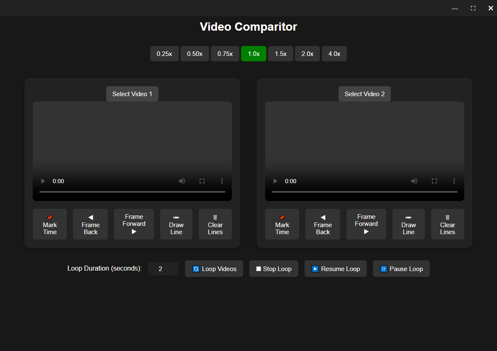

# GolfSwingVideoComparison

Was created for golfers but can be used by anyone. It allows golfers to compare their swings with other players, take a video of your swing, and get a video of another golfers swing and you can compare the two. You can draw on the video so you can compare better.

This is a desktop application created with Electron, but can easily be made into a website.

You're able to go frame by frame through each video to sync them up perfectly, and when you are ready, click the Mark Time button to mark that timestamp. Then you can use the loop controls at the bottom to start looping! Use the Draw Line button to be able to draw on the videos, and Clear Lines will clear the lines from the specified video!
